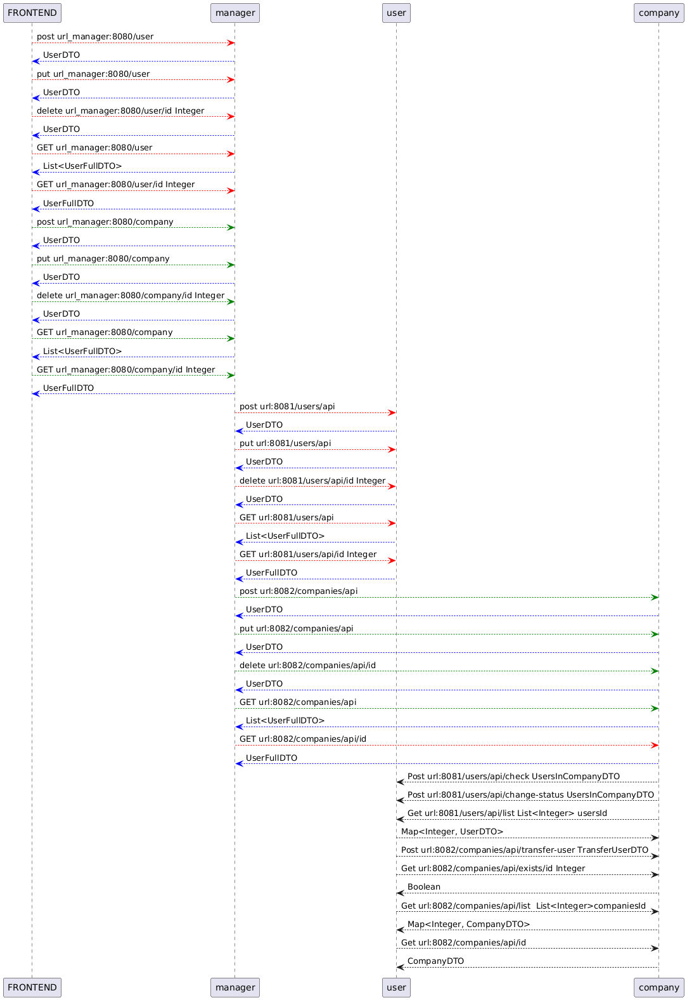

# Описание #
=
## Структура проекта ##
-
1. **discovery-service** - eureka сервер для взаимодействия микросервисов.
2. **companies-service** - микросервис, отвечающий за хранение в базе данных и предоставление информации об организациях;
3. **users-service** - микросервис, отвечающий за хранение в базе данных и предоставление информации о пользователях;
4. **manager-service** - микросервис, обеспечивающий взаимодействие между Frontend и двумя микросервисами: 
 company-service и manager-service.

## Взаимодействия ##

Взаимодействие между сервисами показано на схеме.

Для передачи по http объектов используются **D**ata **Transfer** **O**bject, которые реализованы в **common-module**:\
1. **CompanyDTO** -\  
{\
   "id":<id>,\    
   "name":<"Название компании">,\    
   "budget":<Бюджет компании>,\
   "usersId":<[Список id пользователей]>\    
}\
2. **UserDTO** -\  
{\
   "id":<id>\  
   "name":<"Имя пользователя">,\  
   "fam":<"Фамилия пользователя">,\  
   "phoneNumber":<"Номер телефона">,\  
   "companyId":<id компании или 0>.\  
}\  
3. **CompanyFullDTO** - в этом формате данные возвращаются при get-запросе.\
   {\
   "id":<id>,\    
   "name":<"Название компании">,\    
   "budget":<Бюджет компании>,\
   "List<UserDTO>:{Список пользователей}\    
   }\
4. **UserFullDTO** - в этом формате данные возвращаются при get-запросе.\
   {\
   "id":<id>\  
   "name":<"Имя пользователя">,\  
   "fam":<"Фамилия пользователя">,\  
   "phoneNumber":<"Номер телефона">,\  
   "CompanyDTO":<Компания>\  
   }\
5. **TransferDTO** - используется для передачи информации между сервисами companies-service и users-service.\
   "userId":<id>,\
   "companyIdFrom":<id компании, из которой пользователь переводится>,\
   "companyIdTo":<id компании, в которую пользователь переводится>\
   }\
6. **UsersInCompanyDTO** - используется для передачи информации между сервисами companies-service и users-service\
для проверки соответствия списка пользователей данной компании.\
{\
   "usersId":<множество id пользователей>,\
   "companyId":<id компании>\
   }\